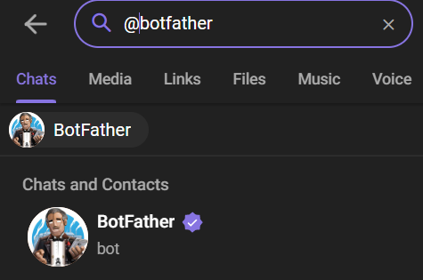
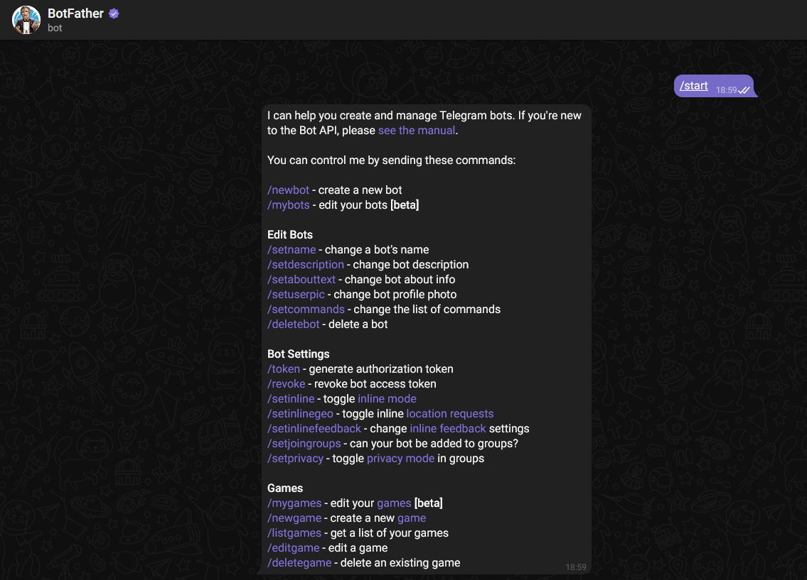
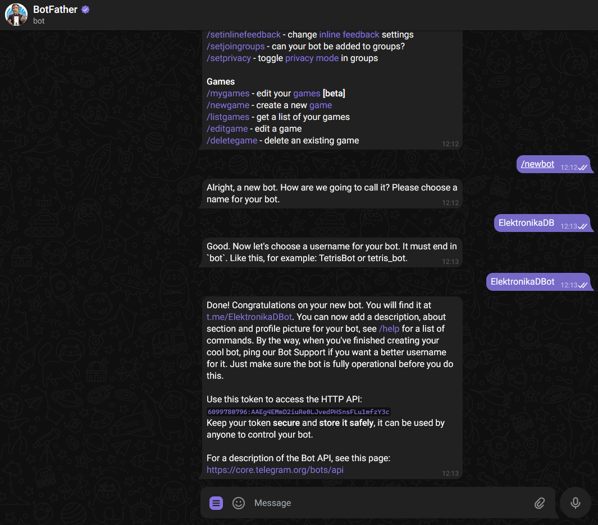

# Jetson Nano Object detection alarm

Procedure to make inference in Jetson Nano with yolo-v7. [Here](Object_detection_methods.md) you could find more information about object detection methods

## Set up Jetson Nano

Go to [this](https://developer.nvidia.com/embedded/learn/get-started-jetson-nano-devkit#intro) step by step tutorial.

## Install dependecies and download packages

Firs of all we will have to install python dependecies. For that open a terminal an execute the followin commands.

```bash
sudo apt-get update
sudo apt-get install python3-pip -y
sudo apt-get install dialog -y
sudo apt-get install v4l2loopback-dkms
sudo modprobe v4l2loopback
sudo apt-get install nano 
```

## Preàre the docker container

First of all we need to clone the repository of jetson inference and go to the folder jetson_inference.

```bash
git clone https://github.com/mikelalda/Alarm-Yolo.git

```

Clone jetson-inference repository

```bash
git clone https://github.com/dusty-nv/jetson-inference.git

```

Change the file jetson-inference/docker/tag.sh line 25 CONTAINER_IMAGE="jetson-inference:r32.5.0" to:

```bash
#line 25 CONTAINER_IMAGE="jetson-inference:r32.5.0" to:
CONTAINER_IMAGE="mikelalda/jetson-inference:donbosco"
```

Each time to run the container follow the next steps:

```bash
cd jetdon-inference
docker/run.sh --volume path_to/Alarm-Yolo:/Alarm-Yolo
```

## Telegram bot creation

* Search for @botfather in Telegram.



* Start a conversation with BotFather by clicking on the Start button.



* Type `/newbot`, and follow the prompts to set up a new bot. The BotFather will give you a token that you will use to authenticate bot and grant it access to the Telegram API.



## Run inference

In the file Alarm-Yolo/main.py we need to change the line 17 with our token.


Once having done all the steps, run this in the docker terminal.

```bash
python3 -m pip install pyTelegramBotAPI==3.8.3
python3 main.py
```
