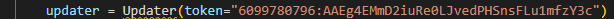

# YOLO - Jetson Nano

Procedure to make inference in Jetson Nano with yolo-v7. [Here](Object_detection_methods.md) you could find more information about object detection methods

## Set up Jetson Nano

Go to [this](https://developer.nvidia.com/embedded/learn/get-started-jetson-nano-devkit#intro) step by step tutorial.

## Install dependecies and download packages

Firs of all we will have to install python dependecies. For that open a terminal an execute the followin commands.

```bash
sudo apt-get update
sudo apt-get install python3-pip -y

pip3 install --upgrade setuptools pip --user
pip3 install --ignore-installed PyYAML
pip3 install Pillow
pip3 install pyTelegramBotAPI==0.3.6
pip3 install nvidia-pyindex
pip3 install pycuda
pip3 install -U albumentations --no-binary qudida,albumentations
sudo apt-get install nvidia-tensorrt nano -y
```


For Pytorch installation, first we need to install dependencies and check the Jetpack version:

```bash
wget https://nvidia.box.com/shared/static/fjtbno0vpo676a25cgvuqc1wty0fkkg6.whl
sudo apt-get install python3-pip libopenblas-base libopenmpi-dev libomp-dev libomp5
pip3 install Cython
pip3 install numpy torch-1.10.0-cp36-cp36m-linux_aarch64.whl
```

Then install torchvision

```bash
sudo apt-get install libjpeg-dev zlib1g-dev libpython3-dev libavcodec-dev libavformat-dev libswscale-dev
git clone --branch v0.11.1 https://github.com/pytorch/vision torchvision   # see below for version of torchvision to download
cd torchvision
export BUILD_VERSION=0.9.0  # where 0.x.0 is the torchvision version  
python3 setup.py install --user
cd ../  # attempting to load torchvision from build dir will result in import error
```

After having installed the dependencies there are two options. One is to just use the yolov7.trt file to run the program and the second one is to do all from scratch. Both of them are explained bellow.

## Telegram bot creation

* Search for @botfather in Telegram.


* Start a conversation with BotFather by clicking on the Start button.


* Type `/newbot`, and follow the prompts to set up a new bot. The BotFather will give you a token that you will use to authenticate bot and grant it access to the Telegram API.


## Run inference

First of all we need to clone the repository and go to the folder.

```bash
git clone https://github.com/mikelalda/Alarm-Yolo.git

cd Alarm-Yolo
```

In the file main.py we need to change the line 83 with our token.



Once having done all the steps, run this in the terminal.

```bash
python3 main.py --model_path models/yolov7-tiny-nms.trt
```

## To make a custom YOLOv7 Tensorrt file

After having installed the dependencies and opencv, download the yolov7 implementation and the needed weights. There are more weights into [this](https://github.com/WongKinYiu/yolov7/releases) folder

```bash
git clone https://github.com/WongKinYiu/yolov7
cd yolov7
ls

wget https://github.com/WongKinYiu/yolov7/releases/download/v0.1/yolov7-tiny.pt
```

Then this model is exported to onnx usin the script provided by the repository owner.

```bash
python export.py --weights ./yolov7-tiny.pt --grid --end2end --simplify --topk-all 100 --iou-thres 0.65 --conf-thres 0.35 --img-size 640 640
ls
```

That onnx model can be checked with [Netron](https://netron.app), an APP for visualising ONNX models.

After that the onnx model is converted to tensorrt (Trt) model with another repository usage.

```bash
cd ../
git clone https://github.com/Linaom1214/tensorrt-python.git
cd tensorrt-python
python export.py -o /content/yolov7/yolov7-tiny.onnx -e ./yolov7-tiny-nms.trt -p fp16
ls
```

Now the model is ready to use with Trt

## To increase the performance, install opencv with gpu

To install opencv with gpu capability. Follow this steps (see the [link](https://qengineering.eu/install-opencv-4.5-on-jetson-nano.html) for more information):

1- Enable the installation

```bash
# a fresh start, so check for updates
sudo apt-get update
# sudo apt-get upgrade
# install nano
sudo apt-get install nano -y
# install dphys-swapfile
sudo apt-get install dphys-swapfile -y
# enlarge the boundary (4.5.2 and higher) 
sudo nano /sbin/dphys-swapfile
# change the varibale value
# CONF_MAXSWAP=4096
# reboot afterwards

```

2- Install the repo and OpenCV

```bash
git clone Alarm-Yolo
cd Alarm_Yolo
sudo chmod 755 ./OpenCV-4-6-0.sh
./OpenCV-4-6-0.sh
# once the installation is done...
# remove the dphys-swapfile now
sudo /etc/init.d/dphys-swapfile stop
sudo apt-get remove --purge dphys-swapfile
# just a tip to save an additional 275 MB
sudo rm -rf ~/opencv
sudo rm -rf ~/opencv_contrib 
```
